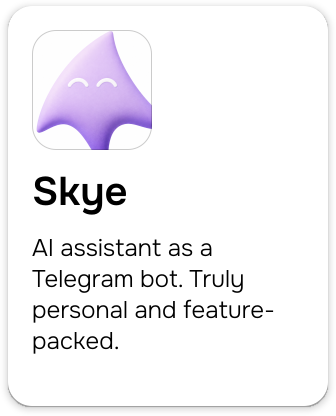
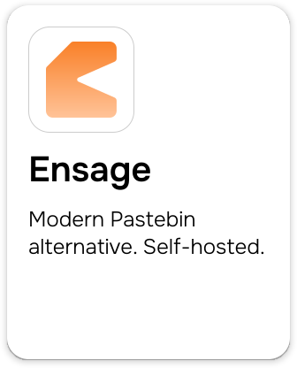
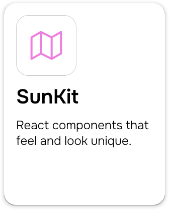
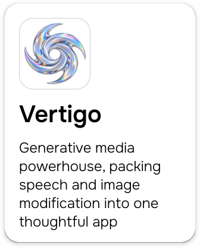

# oh hi, i'm `evelyn`! 👋

i usually make some self-hosted web and cli tools. sometimes not.

> check these out first ⤵️

|  |  |  |  | 
| :--- | :--- | :--- | :--- |

and more in my [repos](https://github.com/evvyraine?tab=repositories)!

